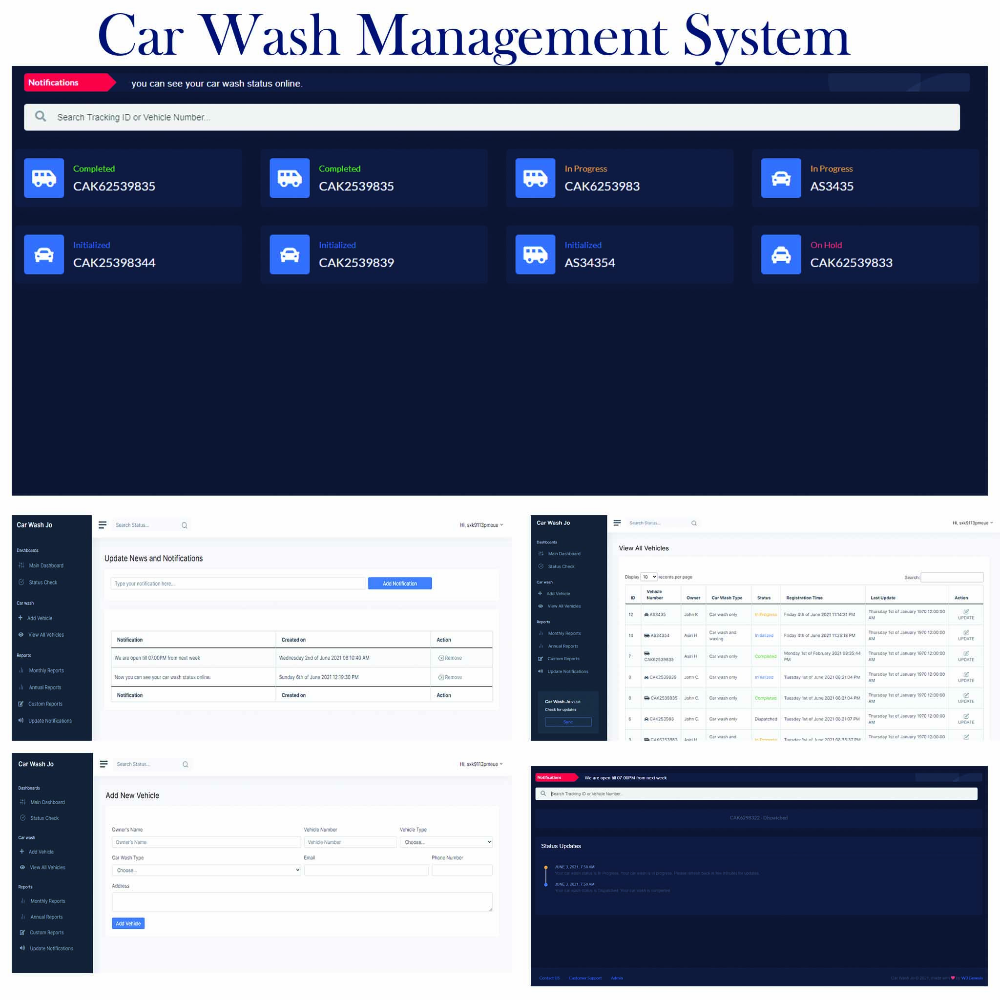

# PHP MySQL Car Wash Management System
This is a full stack Car Wash Management System done using PHP and MySQL.

## Features
- Admin Login, session handling and logout
- Car wash status dashboard (For wide screen devices)
- Car wash Status (For mobile devices)
- Add new car
- Update status [Initialized, In Progress, On Hold, Completed, Dispatched]
- Add notifications
- Show Notifications in Dashboard
- Monthly Statistics
- View / Filter Car Wash history
- Send Push Notifications
- Send Email updates to the customer
- Enhanced .htaccess file for caching and Gzip compression (loading time less than 0.6 milis)
- Realtime data (no need to refresh bashboard)


## How to setup
1. clone the project 
```bacs 
git clone  https://github.com/w3gen/carwash-jo.com.git 
```
2. change admin\includes\dbconfig.php
```php
$con = mysqli_connect("host","username","password","database");
```
3. Upload all project files into your host
4. import the database file Database\carwash_data.sql
5. change the Car Wash Name, Car Wash Email, Car Wash Contact Number, username, email and password
6. You are all set to use the Car Wash Management System

### Contribution
 Asiri H [Hire Me](https://www.freelancer.com/get/asirihewage?f=give)

### TODO
- support multiple users from frontend
- Send SMS Alerts
- Styling and Coding standard enhansments
- support multiple car washes


<hr>

### demo : https://www.carwash-jo.com

